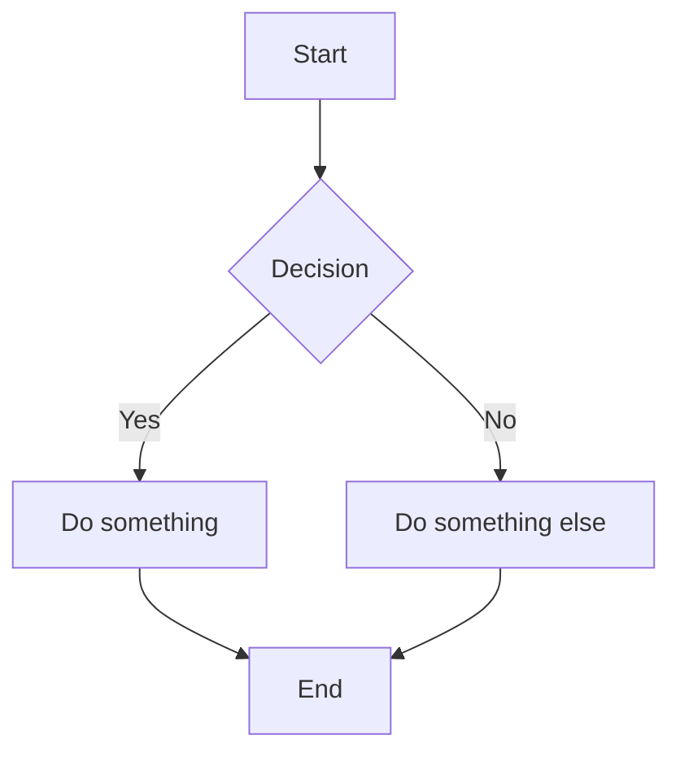

# 🚀 Welcome to My Advanced Retype Site

This documentation showcases **Retype features** with advanced Markdown and layout examples.

---

## 📋 Table of Contents

1. [Introduction](#introduction)
2. [Features](#features)
3. [Mermaid Diagrams](#mermaid-diagrams)
4. [Data Tables](#data-tables)
5. [Callouts & Tips](#callouts--tips)
6. [Code Samples](#code-samples)

---

## 🧠 Introduction

This site is built using [Retype](https://retype.com). Everything you see is written in Markdown and rendered as a beautiful, fast static site.

---

## ✨ Features

- ✅ Simple to use
- ⚡ Fast and secure
- 🎨 Automatically styled
- 🧾 Uses Markdown
- 🌐 Supports Mermaid diagrams
- 🔐 Password-protected pages (Pro)
- 📦 Deployable on GitHub Pages, Netlify, etc.

---

## 🔁 Mermaid Diagrams

### 📊 Flowchart

